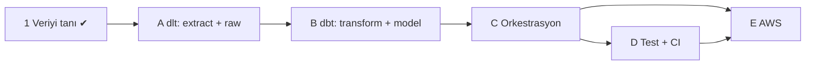

# Yol Haritası

Bu dosya **planı** tutar: hangi adım, hangi alt adımlar, ne zaman bitmiş sayılır,
neye bağımlı.

> **Burada durum bilgisi yoktur.** Nerede kaldığımız için → [`PROGRESS.md`](PROGRESS.md)
> Sabit sözleşme (hedef, tercihler, mimari) için → [`PROJECT_CONTEXT.md`](PROJECT_CONTEXT.md)

Üç dosyanın iş bölümü:

| Dosya | Soru | Değişme sıklığı |
|---|---|---|
| `PROJECT_CONTEXT.md` | Ne inşa ediyoruz, neden? | Nadiren |
| `ROADMAP.md` | Hangi sırayla, ne zaman bitmiş sayılır? | Adım revize edildikçe |
| `PROGRESS.md` | Şu an neredeyim? | Her alt adımda |

---

## REVİZYON — 2026-08-15: araç-merkezli tek tur

Bu dosyanın önceki hâli **9 adımdı ve her katmanı elle yazmayı** öngörüyordu:
kendi retry döngüsü, kendi sayfalama mantığı, kendi atomic write'ı, Pydantic ile
kendi transform'u.

**Neden değişti.** Adım 1'de veri davranışı elle ölçüldü (hata kodları, rate limit,
`limit` parametresinin kırpması, şema derinliği). O bilgi bankaya yazıldı — ADR-0004,
0005, 0006 ve notlar 11, 13, 14, 15, 17'de duruyor. Aynı davranışların *kodunu* elle
yazmak yeni bilgi üretmiyor, sadece süre harcıyor. Sektörde bu katman zaten elle
yazılmıyor: extract + raw load için **dlt**, transform için **dbt** kullanılıyor.

**Ne değişmedi.** Kararların gerekçesi. Her araç, çözdüğü problem üzerinden
anlatılacak — "dlt kurduk, çalıştı" değil, "1.8'de ölçtüğüm rate limit davranışını
dlt şu şekilde ele alıyor, benim yazacağımdan şu yönden farklı".

**Mimari sonucu:** proje **ETL'den ELT'ye** döndü. Transform artık ayrı bir Python
katmanında değil, sorgu motorunun (DuckDB → Athena) içinde SQL olarak yaşıyor.
Gerekçe: ADR-0008.

### Numaralandırma

Eski adım numaraları (0–9) ve alt adımları **yeniden kullanılmadı**. Notlar ve
PROGRESS bu numaralara referans veriyor; aynı numarayı yeni bir içeriğe vermek o
referansları sessizce yalancı yapardı. Yeni adımlar bu yüzden **harf** aldı: A–E.
Eski numaraların nereye gittiği aşağıdaki eşleme tablosunda.

Bu, ADR'lerin asla yeniden numaralanmaması kuralının aynısı: **numara bir kimliktir,
bir sıra değildir.**

---

## Kurallar

- **Tek seferde tek alt adım.** A.3 bitmeden A.4'e geçilmez.
- Her adımın "bitti" tanımı, `PROJECT_CONTEXT.md` §6'daki **genel kontrol listesine ek**
  şartlardır.
- **ADR numaraları burada verilmez.** Burada sadece ADR **adayı** konular listelenir.
- Alt adım listesi kutsal değil. Gerçekle çelişirse liste değişir, gerçek değil.
- **Her adımda not yazılır.** Araç kullanmak, notu atlamanın gerekçesi değil — tersine,
  "bu araç benim yazacağım şeyi nasıl çözüyor" notu daha değerlidir.

---

## Bağımlılık haritası

Kritik yol: **A → B → C → E**. D kritik yolun dışında ama E'den önce bitmelidir —
test edilmemiş kodu buluta taşımak, hatayı en pahalı yerde bulmaktır.

---

## Eski numara eşlemesi

| Eski | Neydi | Yeni durum |
|---|---|---|
| 0.1–0.6 | Repo kurulumu | **Tamamlandı.** Değişmedi. |
| 1.1–1.8 | Veriyi tanı | **Tamamlandı** (1.8 kapanışı hariç). Çıktısı bu revizyonun girdisi. |
| 2.1–2.6 | pydantic-settings ile config | → **A.2.** `dlt.secrets` ile. Fail-fast ve secret sızıntısı konuları aynen duruyor, aracı değişti. |
| 3.1–3.8 | Elle HTTP client, retry, backoff | → **A.3.** dlt `rest_api` source. Elle yazılmıyor, davranışı ölçülüp notlanıyor. |
| 3.9 | Sayfalama | → **A.3.** dlt paginator. ADR-0006'nın top-100 kararı geçerli, uygulaması dlt'nin. |
| 4.1–4.7 | Raw katman, path builder, atomic write | → **A.4.** dlt `filesystem` destination. Partition layout config'ten. |
| 5.1–5.8 | Pydantic + pandas transform | → **B.** dbt modelleri (SQL). |
| 6.1–6.8 | main.py, CLI, backfill, run_id | → **C.** Küçültüldü: CLI ve backfill iptal (gerekçe C'de). |
| 7.1–7.7 | pytest | → **D.1–D.3.** Küçültüldü: transform testleri dbt testlerine devredildi. |
| 8.1–8.8 | ruff, mypy, Makefile, pre-commit, CI, Docker | → **D.4–D.6.** mypy strict ve Docker **iptal** (gerekçe D'de). |
| 9.1–9.11 | AWS | → **E.** Glue Crawler **iptal**, partition projection ile değiştirildi. |

---

## Adım A — Extract + raw load (dlt)

**Amaç:** Last.fm'den veriyi çekip raw katmana yazmak — ve bunu yaparken, elle
yazsaydım hangi problemleri çözmem gerekeceğini **aracın çözümü üzerinden** görmek.

| # | Alt adım | Ne çözüyor / ne öğretiyor |
|---|---|---|
| A.1 | dlt'nin modeli: `source` / `resource` / `destination` / `pipeline` / `state` nedir | Aracın zihin haritası. Hangi kavram benim hangi elle-yazacağım parçama denk geliyor |
| A.2 | Secret yönetimi: `.dlt/secrets.toml` vs env vs mevcut `.env` — hangisi, neden; git'e sızmaması | Eski 2.x'in özü. `.gitignore` sınavı ikinci kez |
| A.3 | `rest_api` source: endpoint, `format=json`, paginator, ADR-0006'nın top-100 limiti | Eski 3.x. Retry/backoff/pagination dlt'de nasıl yapılandırılıyor, varsayılanları ne |
| A.4 | `filesystem` destination: parquet mi jsonl mi, `layout` ile partition (`dt=`), local `data/` → `s3://` aynı config | Eski 4.x. Raw immutability ve partition şeması korunuyor mu |
| A.5 | Yazma davranışı: `write_disposition` (`replace` / `append` / `merge`) — hangisi bizim grain'imize uyuyor | **İdempotency.** Eski 4.5'in aynısı, kararı dlt'ye devretmiyoruz |
| A.6 | Hata yolu ölçümü: bozuk `api_key` ile pipeline çalıştır — dlt ne yapıyor, kaç kez deniyor, exit code ne | 1.3'te ölçtüğüm `403 + error:10` davranışının araç tarafındaki karşılığı |
| A.7 | dlt'nin ürettiği `_dlt_*` metadata tabloları / kolonları: load_id, schema, state | Lineage ve incremental'ın altyapısı. Eski 4.6'nın hazır hâli |
| A.8 | Uçtan uca: tek komut → `data/raw/` altında parquet dosyası. İki kez çalıştır, sonucu karşılaştır | Dar dilimin ilk yarısı + idempotency sınavı |

**Bitti tanımı (§6'ya ek):**

- [ ] `data/raw/` altında beklenen partition yolunda gerçek veri var
- [ ] Peş peşe iki çalıştırma sonrası satır sayısı **bilinçli olarak** ya aynı ya artmış — hangisi olduğu ve neden olduğu yazılı
- [ ] Bozuk `api_key` ile pipeline **gürültülü** başarısız oluyor, `echo $?` sıfır değil
- [ ] Hiçbir log satırında ve hiçbir commit'te API key yok
- [ ] Raw dosya yolu `s3://` yapısını birebir taklit ediyor
- [ ] dlt'nin retry/pagination varsayılanları **okundu ve notlandı** — "çalışıyor" yeterli değil

**ADR adayları:**

- Adopt dlt for extraction and raw loading
- Choose the raw file format and partition layout for the filesystem destination
- Choose a write disposition for the raw layer

**Not adayları:** dlt'nin çalışma modeli · dlt state ve incremental loading · elle
yazılan retry vs dlt'nin retry'ı (1.8 ölçümüyle karşılaştırma)

**Bağımlılık:** 1 (grain, şema, rate limit ölçümü). B'ye girdi verir.

---

## Adım B — Transform + veri modeli (dbt-duckdb)

**Amaç:** Asıl hedef bu adım. Raw parquet'ten sorgulanabilir, test edilmiş, katmanlı
bir veri modeli. Buradan sonrası (dbt + Snowflake) aynı kaslar.

| # | Alt adım | Ne çözüyor / ne öğretiyor |
|---|---|---|
| B.1 | dbt projesi kurulumu: `profiles.yml`, `dbt_project.yml`, klasör yapısı — ve bunların repoda nereye gireceği | Proje düzeni. `src/` ile dbt yan yana nasıl durur |
| B.2 | DuckDB'nin rolü: veriyi *tutmuyor*, parquet'i yerinde okuyor (`read_parquet`) | Lakehouse mantığının en küçük hâli. Neden ayrı bir ambar kurmuyoruz |
| B.3 | `sources.yml`: raw parquet'i dbt'ye kaynak olarak tanıtmak, `freshness` | Data contract'ın ilk somut hâli |
| B.4 | **staging** katmanı: `stg_top_tracks` — düzleştirme, tip çevrimi, isimlendirme kuralı | Eski 5.4. Medallion'ın bronze→silver'ı |
| B.5 | **mart** katmanı: grain'i (ADR-0005) uygulayan fact tablosu + gerekiyorsa dimension | **Data modeling'in kendisi.** Fact/dimension, surrogate key, grain koruma |
| B.6 | Materialization seçimi: `view` / `table` / `incremental` / `external` — hangisi nerede, maliyet farkı | Eski 5.6 + 5.7. `incremental` = idempotency'nin dbt'deki karşılığı |
| B.7 | dbt testleri: `not_null`, `unique`, `accepted_values`, `relationships` + bir singular test | Eski 5.8 ve 7.3'ün yerini alıyor. Veri kalitesi kodun değil, modelin sorumluluğu |
| B.8 | Dokümantasyon: model/kolon açıklamaları, `dbt docs generate`, lineage grafiği | Mülakat vitrini. Lineage'ı elle çizmiyoruz |
| B.9 | İki kez `dbt build` → satır sayısı değişmiyor | Idempotency'nin model katmanındaki sınavı |

**Bitti tanımı (§6'ya ek):**

- [ ] `dbt build` temiz geçiyor ve **en az bir test kasten bozulup kırmızıya döndüğü görüldü**
- [ ] Grain korunuyor: mart tablosunda birincil anahtar üzerinde `unique` testi geçiyor
- [ ] Hiçbir sayısal alan string kalmadı — tipler bilinçli
- [ ] Aynı günün `dbt build`'i iki kez koşunca satır sayısı artmıyor
- [ ] Her modelin ve en az kritik kolonların `description`'ı var
- [ ] staging ↔ mart sorumluluk sınırı yazılı: neye staging'de, neye mart'ta dokunulur

**ADR adayları:**

- Transform with dbt on DuckDB instead of Python (ETL → ELT)
- Define the staging / mart layer boundary
- Choose materializations per layer

**Not adayları:** dbt'nin çalışma modeli (compile → run, ref, DAG) · staging/mart
katmanlama · fact ve dimension tabloları · materialization türleri ve maliyeti ·
dbt testleri vs pytest — hangisi neyi test eder

**Bağımlılık:** A. C'ye girdi verir.

---

## Adım C — Orkestrasyon

**Amaç:** İki aracı tek komuta bağlamak. Bu adım **ince** — iş mantığı A ve B'de.

| # | Alt adım | Ne çözüyor |
|---|---|---|
| C.1 | Runner'ın sorumluluğu: sırayla dlt pipeline + `dbt build`, hata yönetimi, başka bir şey değil | Şişen giriş dosyası |
| C.2 | Kısmi başarısızlık: raw yazıldı, dbt patladı — sistem hangi durumda kalıyor | Yarım durum. A.5 ve B.6'nın sistem seviyesindeki sınavı |
| C.3 | Exit code sözleşmesi (0 / 1) | Cron, CI ve EventBridge'in hatayı görmesi. **Geçmiş projenin öldüğü nokta** |
| C.4 | Logging: `run_id`, seviye politikası, dlt ve dbt loglarının nereye gittiği | Bir koşuyu loglardan izleyebilmek |
| C.5 | Uçtan uca: tek komut → API'den mart tablosuna. İki kez çalıştır, aynı sonuç | **Projenin kanıtı** |

**İptal edilenler ve gerekçesi:**

- **CLI (`--date`, `--dry-run`)** — `chart.getTopTracks` tarih parametresi almıyor
  (1.8'de ölçülüyor), yani `--date` ile API'den geçmiş çekilemez. Argparse/typer
  öğrenmek bu projenin konusu değil.
- **Backfill döngüsü** — aynı sebep. Geçmiş sadece ileriye doğru birikir. Raw'ı
  yeniden işlemek zaten `dbt build`.

**Bitti tanımı (§6'ya ek):**

- [ ] **Tek komut** temiz bir makinede API'den mart tablosuna kadar gidiyor
- [ ] Pipeline patladığında `echo $?` sıfırdan farklı — bilerek bozulup denendi
- [ ] "Başarılı" logu, iş gerçekten yapıldıktan **sonra** yazılıyor
- [ ] Tek koşunun log satırları ortak bir `run_id` taşıyor

**ADR adayları:** Keep the entrypoint thin: orchestration only · Define the exit code contract

**Bağımlılık:** A, B. D ve E'ye girdi verir.

---

## Adım D — Test + CI

**Amaç:** Kalite kontrolünü insan disiplininden makineye devretmek — ama sadece
gerçekten değer üreten kısmını.

| # | Alt adım | Ne çözüyor |
|---|---|---|
| D.1 | Test sorumluluk bölüşümü: neyi dbt test eder, neyi pytest | Aynı şeyi iki yerde test etme israfı |
| D.2 | pytest: 1.4'teki fixture'larla dlt source'un şema/parse davranışı | Elimde duran fixture'lar boşa gitmesin |
| D.3 | Hata yolu testi: bozuk payload / bozuk key | Sadece mutlu yolu test etme tuzağı |
| D.4 | `ruff` (lint + format), `pyproject.toml` konfigürasyonu | Stil tartışması; sessiz buglar |
| D.5 | `Makefile` — `make run`, `make test`, `make lint` | "Hangi komutla çalışıyordu" |
| D.6 | GitHub Actions: `uv sync` → ruff → pytest → `dbt build` (fixture verisiyle) | "Bende çalışıyor" |
| D.7 | README'yi portfolyo kalitesine çıkar: mimari şeması, çalıştırma, dlt/dbt gerekçesi | Mülakat vitrini |

**İptal edilenler ve gerekçesi:**

- **mypy strict** — kodun büyük kısmı artık config (toml/yml) ve SQL. Tip
  denetiminden fayda görecek Python yüzeyi çok küçük kaldı.
- **pre-commit** — CI zaten aynı üç komutu koşuyor. İkinci bir kurulum katmanı,
  bu boyutta proje için net kazanç değil. (Gerçek ekipte kurulur — notta yazar.)
- **Docker** — E'de Lambda **zip** paketleme seçiliyor. Docker sadece container
  image paketlemesi seçilseydi gerekliydi.

**Bitti tanımı (§6'ya ek):**

- [ ] CI yeşil ve **kırık kodda gerçekten kırmızıya dönüyor** (bilerek bozup denendi)
- [ ] `make lint`, `make test`, `make run` çalışıyor
- [ ] Testler ağ bağlantısı ve gerçek secret olmadan geçiyor
- [ ] README'deki komutlar kopyala-yapıştır ile çalışıyor

**ADR adayları:** Split test responsibility between dbt tests and pytest · Skip mypy and pre-commit, with reasons

**Bağımlılık:** C. E'ye girdi verir.

---

## Adım E — AWS

**Amaç:** Aynı pipeline'ı buluta taşımak. "Aynı" kelimesi kritik: A.4'te `layout`
config'i doğru kurulduysa local → S3 geçişi **kod değişikliği değil, config
değişikliği** olmalı. Bu adım o iddianın sınavı.

| # | Alt adım | Ne çözüyor |
|---|---|---|
| E.1 | IAM: least privilege, kullanıcı vs rol | `AdministratorAccess` alışkanlığı |
| E.2 | S3 bucket: isimlendirme, versioning, public access bloğu, lifecycle | Geri dönülemez silme; maliyet |
| E.3 | dlt destination'ı `s3://`'ye çevir — **kod değişmeden** | 9.3'ün sınavı. Değişiyorsa A.4 yanlış kurulmuş |
| E.4 | Athena: external table + **partition projection** (Glue Crawler yok) | Şema keşfi. Crawler = fazladan servis, maliyet ve gecikme |
| E.5 | Athena sorgusu, taranan byte ölçümü, partition kullanıldığının kanıtı | Tek sorguda yüksek fatura |
| E.6 | Lambda paketleme (zip), boyut limiti, timeout, cold start | Deploy edilemeyen fonksiyon |
| E.7 | Secret: SSM Parameter Store / Secrets Manager | Lambda env değişkeninde duran API key |
| E.8 | EventBridge cron trigger | Günlük tetikleme |
| E.9 | CloudWatch: log grubu + **bir** alarm (pipeline sessizce çalışmıyor mu) | Sessiz başarısızlık |
| E.10 | Budget alarm + aylık tahmini maliyet | Sürpriz fatura |

> **Açık risk:** dbt'nin Lambda içinde koşması boyut ve süre olarak sıkışık.
> E.6'da iki seçenek tartışılacak: (a) dbt'yi Lambda'ya sokmak, (b) Lambda sadece
> extract+raw, transform ayrı tetiklenir. Karar ADR olur. **Bu tercih şimdiden
> yapılmıyor** — E.3–E.5 ölçülmeden karar tahmine dayanır.

**Bitti tanımı (§6'ya ek):**

- [ ] Pipeline elle müdahale olmadan günlük çalışıyor
- [ ] Local ve S3 modu **aynı kod yolunu** kullanıyor — ikinci sürüm yok
- [ ] Athena'da anlamlı bir SQL sorgusu sonuç döndürüyor ve **partition kullanıyor** (taranan byte ölçüldü)
- [ ] Sessiz başarısızlıkta haber veren bir alarm var
- [ ] IAM politikası wildcard değil
- [ ] Budget alarm kurulu, aylık tahmini maliyet biliniyor

**ADR adayları:** Use partition projection instead of a Glue Crawler · Store secrets in SSM · Choose where dbt runs in the cloud

**Bağımlılık:** C, D. Son adım.

---

## Bu haritanın bilinen zayıf noktaları

- **A ve B'de iki yeni araç aynı anda öğreniliyor.** Bir şey kırıldığında hangi
  aracın suçu olduğunu ayırt etmek zor olabilir. Panzehir: A tamamen bitmeden
  B'ye geçilmiyor.
- **E hâlâ en riskli adım.** 10 alt adım, gerçek para harcanan tek yer, geri alması
  en zor olanı. Bölünmesi gerekebilir.
- **Elle HTTP client yazma öğrenmesi bilinçli olarak feda edildi.** Karşılığında
  Adım 1'in ölçümleri ve A.3/A.6'daki "dlt bunu nasıl yapıyor" incelemesi var.
  Bu bir takas, bedava değil.
