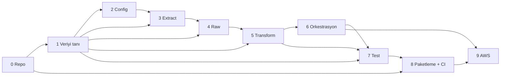

# Yol Haritası

Bu dosya **planı** tutar: hangi adım, hangi alt adımlar, ne zaman bitmiş sayılır,
neye bağımlı.

> **Burada durum bilgisi yoktur.** Nerede kaldığımız için → [`PROGRESS.md`](PROGRESS.md)
> Sabit sözleşme (hedef, tercihler, mimari) için → [`PROJECT_CONTEXT.md`](PROJECT_CONTEXT.md)

Üç dosyanın iş bölümü:

| Dosya | Soru | Değişme sıklığı |
|---|---|---|
| `PROJECT_CONTEXT.md` | Ne inşa ediyoruz, neden? | Nadiren |
| `ROADMAP.md` | Hangi sırayla, ne zaman bitmiş sayılır? | Adım revize edildikçe |
| `PROGRESS.md` | Şu an neredeyim? | Her alt adımda |

---

## Kurallar

- **Tek seferde tek alt adım.** 3.4 bitmeden 3.5'e geçilmez.
- Her adımın "bitti" tanımı, `PROJECT_CONTEXT.md` §6'daki **genel kontrol listesine ek**
  şartlardır. Genel liste her adım için zaten geçerlidir.
- **ADR numaraları burada verilmez.** ADR'ler yazıldıkları anda sıradaki numarayı alır.
  Peşinen numara ayırmak, bir adım ADR üretmezse boşluk veya yeniden numaralandırma
  demektir — `docs/adr/README.md`'nin açık ihlali. Burada sadece **ADR adayı konular**
  listelenir; bir karar tartışıldıktan sonra ADR'ye değmezse yazılmaz, bu normaldir.
- Alt adım listesi kutsal değil. Gerçekle çelişirse liste değişir, gerçek değil.

---

## Bağımlılık haritası

Kritik yol: **1 → 3 → 4 → 5 → 6 → 9**. Adım 7 ve 8 kritik yolun dışında ama
9'dan önce bitmelidir — test edilmemiş kodu buluta taşımak, hatayı en pahalı yerde
bulmak demektir.

| Adım | Neye muhtaç | Kime girdi verir |
|---|---|---|
| 0 | — | 1, 8 |
| 1 | 0 | 2, 3, 4, 5, 7 |
| 2 | 1 (hangi env değişkeni gerektiğini bilmek için) | 3 |
| 3 | 1 (payload), 2 (api_key) | 4 |
| 4 | 1 (grain, partition anahtarı), 3 (veri) | 5 |
| 5 | 1 (şema), 4 (raw dosya) | 6, 7 |
| 6 | 3, 4, 5 (çağıracak bir şey olmalı) | 7, 9 |
| 7 | 1 (fixture payload), 5, 6 | 8 |
| 8 | 0 (`pyproject.toml`), 7 (CI'da koşacak test) | 9 |
| 9 | 6 (çalışan pipeline), 8 (paketleme) | — |

**Adım 1'in özel konumu:** beş adıma birden girdi verir. Gerçek payload görülmeden
şema, partition ve model kararları tahmine dayanır. Bu yüzden 1 atlanamaz ve
"nasılsa API dokümanında yazıyor" denerek kısa geçilemez.

---

## Adım 0 — Repo kurulumu

**Amaç:** Kod yazmaya başlamadan önce, yanlış şeyin commit edilmesini yapısal olarak
imkânsız kılmak.

| # | Alt adım | Ne çözüyor |
|---|---|---|
| 0.1 | `.gitignore` | Secret ve türev dosya sızıntısı |
| 0.2 | İlk commit | Geri dönülebilir bir taban noktası |
| 0.3 | `pyproject.toml` + `src/` layout | Paket kimliği, import yolu belirsizliği |
| 0.4 | Sanal ortam (`uv` / `venv`) | "Bende çalışıyordu" problemi |
| 0.5 | `README.md` + `.env.example` | Sözleşmeli config, projeye giriş kapısı |
| 0.6 | Adım 0 kapanış commit'i | — |

**Bitti tanımı (§6'ya ek):**

- [ ] `git status` temiz — hiçbir türev dosya (`__pycache__`, `.venv`, `*.egg-info`) görünmüyor
- [ ] `git check-ignore -v` ile `.env` ve `data/` gerçekten ignore'lu olduğu doğrulandı
- [ ] Paket temiz ortamda kurulabiliyor ve `python -c "import <paket>"` çalışıyor
- [ ] `.env.example` var, gerçek `.env` yok — ikisi arasındaki anahtar listesi aynı
- [ ] README bir yabancının repoyu klonlayıp çalıştırmasına yetiyor

**ADR adayları:**

- Use `src/` layout (0.3)
- Choose `uv` over `venv` + `pip` — ya da tersi (0.4)
- Package naming (0.3, ADR'ye değmeyebilir — küçük karar)

**Bağımlılık:** Yok. Her şeyin başlangıcı.

---

## Adım 1 — Veriyi tanı

**Amaç:** Tek satır pipeline kodu yazmadan, gerçek veriyi elle görmek. Bu adımın
çıktısı kod değil, **bilgi ve bir örnek dosya**.

| # | Alt adım | Ne çözüyor |
|---|---|---|
| 1.1 | Last.fm API key al, `.env`'e koy | Erişim; ve `.env`'in gerçekten ignore'lu olduğunun sınavı |
| 1.2 | API'yi elle çağır (`curl` / `httpie`), `format=json` ile ve olmadan | XML tuzağını gözle görmek |
| 1.3 | Bozuk `api_key` ile çağır | HTTP 200 + gövdede `error` davranışını **kendi gözünle** doğrulamak |
| 1.4 | Gerçek payload'ı diske kaydet | Adım 7'nin fixture'ı; şema tartışmasının kanıtı |
| 1.5 | Payload anatomisi: alan listesi, tipler, null'lar, iç içelik | Sayıların string geldiğini fark etmek |
| 1.6 | **Grain kararı**: bir satır neyi temsil ediyor | Tüm transform bu cevaba dayanır |
| 1.7 | Hedef şema taslağı (tablo hâlinde, kod değil) | Adım 5'in girdisi |
| 1.8 | Rate limit'i ölç: ardışık istek, ne zaman kısılıyor | Adım 3'ün retry stratejisinin gerçek verisi |

**Bitti tanımı (§6'ya ek):**

- [ ] En az bir gerçek payload dosyası repoda duruyor ve commit edildi
- [ ] Hata payload'ı da kaydedildi (başarı yolu kadar değerli)
- [ ] Grain tek cümleyle yazılabiliyor: "Bir satır = ..."
- [ ] Hedef şema tablosu var: alan adı, kaynak yol, tip, nullable, açıklama
- [ ] "Bu alan neden var / neden yok" sorusuna her alan için cevap verilebiliyor
- [ ] Rate limit davranışı tahmin değil, ölçüm

**Payload dosyası nereye?** `tests/fixtures/` mi `docs/samples/` mi — 1.4'te karara
bağlanacak. Aynı dosyanın iki amacı var: insan okuyacak (doküman) ve test okuyacak
(fixture). İki kopya tutmak sapma demektir.

**ADR adayları:**

- Store a real API payload as the schema source of truth
- Define the data grain for the first pipeline slice

**Bağımlılık:** 0'a muhtaç (repo olmalı). 2, 3, 4, 5, 7'ye girdi verir.

---

## Adım 2 — Config

**Amaç:** Ayarların koddan ayrılması ve **eksik ayarın çalışma zamanında değil,
başlangıçta** patlaması.

| # | Alt adım | Ne çözüyor |
|---|---|---|
| 2.1 | Neyin config olduğuna karar ver: env vs sabit | Her şeyi "esnek olsun diye" env yapma tuzağı |
| 2.2 | `pydantic-settings` ile `Settings` sınıfı | Tip güvenliği + doğrulama |
| 2.3 | `.env` okuma, `.env.example` senkronu | Sözleşmenin yazılı olması |
| 2.4 | Import-time yan etkisi: modül seviyesinde `settings = Settings()` mi, factory mi | `import` edince patlayan modül problemi |
| 2.5 | Eksik/bozuk env ile fail-fast doğrulaması | Sessiz `None` yerine gürültülü hata |
| 2.6 | Secret'ın log ve traceback'e sızmaması (`SecretStr`) | API key'in log dosyasında bulunması |

**Bitti tanımı (§6'ya ek):**

- [ ] `.env` silinip program çalıştırıldığında **açık ve tek bir hata** veriyor
- [ ] Hata mesajı hangi değişkenin eksik olduğunu söylüyor
- [ ] `print(settings)` ve traceback çıktısında API key görünmüyor
- [ ] `.env.example` içindeki anahtar seti `Settings` alanlarıyla birebir aynı
- [ ] Test kodu gerçek `.env` olmadan da config üretebiliyor

**ADR adayları:**

- Use pydantic-settings for configuration
- Load settings lazily instead of at import time

**Bağımlılık:** 1'e muhtaç (hangi ayarların gerektiğini bilmeden config yazılmaz).
3'e girdi verir.

---

## Adım 3 — Extract client

**Amaç:** Ağın güvenilmez olduğunu varsayan bir istemci. Hata yönetimi sonradan
eklenen süs değil, bu adımın **ana konusu**.

| # | Alt adım | Ne çözüyor |
|---|---|---|
| 3.1 | İstemcinin sorumluluk sınırı: ne yapar, ne **yapmaz** (disk yazmaz, transform etmez) | Tanrı-sınıf tuzağı |
| 3.2 | `requests.Session` + `timeout` | Sonsuza kadar asılı kalan istek |
| 3.3 | Gövdedeki `error` kontrolü → özel exception hiyerarşisi | Last.fm'in HTTP 200 yalanı |
| 3.4 | Retry + exponential backoff + jitter | Geçici ağ hatası; thundering herd |
| 3.5 | Hangi hata retry'lanır, hangisi **asla** (401/invalid key vs 429/5xx) | Boşuna 5 kez denenen kalıcı hata |
| 3.6 | Rate limit'e saygı (throttle) | 1.8'de ölçülen limitin altında kalmak |
| 3.7 | Structured logging: seviye, alan, secret maskeleme | Teşhis edilebilirlik |
| 3.8 | Elle uçtan uca çağrı — gerçek veri geldiğini doğrula | Kâğıt üstünde çalışan kod tuzağı |
| 3.9 | **Sayfalama:** hedef kayıt sayısına ulaşana kadar sayfa çek; sayfa boyutu `@attr`'dan okunur, koda gömülmez | Sunucunun `limit`'i sessizce kırpması; sayfa sayısını sabitlemek (ADR-0006) |

> **3.9 neden sonda?** Çalıştırma sırası olarak 3.7'den önce gelir — sayfalama döngüsü
> retry ve throttle'ın üstüne kurulur, loglama ve uçtan uca kontrol ondan sonra gelir.
> Ama **numara bir kimliktir, bir sıra değildir**: `3.7` başka dosyalardan referanslı
> (not 11 §, PROGRESS 1.2). Araya sokup yeniden numaralamak o bağlantıları sessizce
> kırar. Aynı sebeple ADR'ler de asla yeniden numaralanmaz.

**Bitti tanımı (§6'ya ek):**

- [ ] Bozuk API key ile çağırınca **exception fırlıyor** — boş dict dönmüyor
- [ ] Hata sınıfları ayrık: auth hatası ile geçici ağ hatası aynı `except`'e düşmüyor
- [ ] Retry'ın gerçekten beklediği log çıktısında görülüyor (deneme no + bekleme süresi)
- [ ] Kalıcı hatada retry **yapılmıyor** — bu da loglanıyor
- [ ] Hiçbir log satırında API key yok
- [ ] İstemci hiçbir dosyaya yazmıyor (sorumluluk sınırı testi)
- [ ] Sayfa boyutu **hiçbir yerde sabit yazılmıyor** — `@attr.perPage`'den okunuyor
- [ ] Hedef sayıya ulaşılmadan sayfalar biterse bu **hata olarak görünüyor**, sessizce
      eksik veri dönmüyor
- [ ] Bir sayfa başarısız olduğunda retry **o sayfaya** uygulanıyor, tüm çekim baştan
      başlamıyor

**ADR adayları:**

- Treat HTTP 200 with an error body as a failure
- Define a retry policy: which errors are retried and which are not
- Define the exception hierarchy for the extract layer

**Bağımlılık:** 1 (payload ve hata şekli) + 2 (api_key) gerekli. 4'e girdi verir.

---

## Adım 4 — Raw katman

> ⚠️ **Bu adımın alt adımları Adım 1'de gerçek payload görüldükten sonra revize
> edilecek.** Partition anahtarı, dosya adlandırması ve manifest içeriği payload'ın
> gerçek şekline bağlıdır. Aşağıdaki liste bir taslaktır, sözleşme değil.

**Amaç:** API'den geleni **hiç dokunmadan** kalıcı hâle getirmek. Raw katmanın tek
işi: transform yanlış yazıldığında API'yi tekrar çağırmak zorunda kalmamak.

| # | Alt adım | Ne çözüyor |
|---|---|---|
| 4.1 | Raw'ın sözleşmesi: neye dokunulmaz, neden | "Küçük bir temizlik yapayım" tuzağı |
| 4.2 | Partition şeması ve dosya yolu (`method=`, `dt=`) | Sorgu maliyeti; S3 uyumu |
| 4.3 | Yol üretimini tek yerden yapmak (path builder) | Yol mantığının koda dağılması |
| 4.4 | Yazma stratejisi: atomic write (`tmp` → `rename`) | Yarım yazılmış dosya |
| 4.5 | İdempotency: aynı gün iki kez çalışınca ne olur — overwrite mi, skip mi, hata mı | Çift kayıt / veri kaybı |
| 4.6 | Metadata: `ingested_at`, kaynak URL, API parametreleri | Altı ay sonra "bu dosya nereden geldi" |
| 4.7 | Uçtan uca: `extract → raw dosya` | İlk gerçek dilim |

**Bitti tanımı (§6'ya ek):**

- [ ] Yazılan JSON, API'nin döndürdüğüyle **byte düzeyinde** karşılaştırılabiliyor
- [ ] Peş peşe iki çalıştırma sonrası `data/raw/` altında beklenen dosya sayısı var
      (ne fazla, ne eksik) — ve bu bilinçli bir karardı
- [ ] Yazma ortasında süreç öldürülürse geride `.tmp` kalıyor, bozuk `.json` kalmıyor
- [ ] Dosya yolu local'de `s3://` yapısını birebir taklit ediyor
- [ ] Yol bir fonksiyondan üretiliyor, string birleştirmesi koda dağılmamış

**ADR adayları:**

- Keep the raw layer immutable
- Choose the raw partition scheme (`method=` / `dt=`)
- Define idempotent write semantics for the raw layer
- Write files atomically via temp-then-rename

**Bağımlılık:** 1 (partition anahtarı hangi alandan gelecek) + 3 (veri) gerekli.
5'e girdi verir.

---

## Adım 5 — Transform

> ⚠️ **Bu adımın alt adımları Adım 1'de gerçek payload görüldükten sonra revize
> edilecek.** Model alanları, tip dönüşümleri ve kalite kontrolleri gerçek şemaya
> bağlıdır. Aşağıdaki liste bir taslaktır, sözleşme değil.

**Amaç:** Ham JSON'dan sorgulanabilir Parquet'e. Bu katman **saf** olmalı: girdi veri,
çıktı veri, arada I/O yok — bu yüzden test etmesi en kolay, en çok değer veren katman.

| # | Alt adım | Ne çözüyor |
|---|---|---|
| 5.1 | Saf fonksiyon sınırı: dosya okuma/yazma transform'un işi değil | Test edilemez kod |
| 5.2 | Pydantic modelleriyle şema doğrulama | Sessizce değişen API |
| 5.3 | Bozuk kayıt politikası: fail-fast mi, kaydı ayır mı (quarantine) | Tek bozuk satır yüzünden düşen pipeline / sessizce kaybolan veri |
| 5.4 | Düzleştirme + tip dönüşümü (string sayılar, unix timestamp, boş string vs null) | 1.5'te görülen gerçek tuzaklar |
| 5.5 | Audit sütunları: `ingestion_date`, `source_file` | Köken takibi (lineage) |
| 5.6 | Parquet yazımı: engine, sıkıştırma, dosya boyutu | Küçük dosya problemi; Athena maliyeti |
| 5.7 | Curated katmanda idempotent yazma (partition overwrite) | Yeniden çalıştırınca çiftlenen satırlar |
| 5.8 | Veri kalitesi kontrolleri: satır sayısı, null oranı, tekillik | Sessiz veri kaybını yakalamak |

**Bitti tanımı (§6'ya ek):**

- [ ] Transform fonksiyonları hiçbir dosyaya dokunmuyor — sadece veri alıp veri döndürüyor
- [ ] Bozuk/eksik alanlı payload verildiğinde davranış **bilinçli ve belgelenmiş**
      (patlıyor ya da ayırıyor — ama sessizce atlamıyor)
- [ ] Parquet dosyası okunup satır sayısı ve tipler doğrulandı
- [ ] Aynı günün transform'u iki kez koşturulunca satır sayısı **artmıyor**
- [ ] Grain korunuyor: birincil anahtar üzerinde çift kayıt yok
- [ ] Her sütunun tipi bilinçli seçildi — hiçbir sayısal alan `object` değil

**ADR adayları:**

- Validate payloads with Pydantic models at the transform boundary
- Choose fail-fast over quarantine for malformed records (ya da tersi)
- Use Parquet for the curated layer
- Add audit columns for lineage

**Bağımlılık:** 1 (hedef şema) + 4 (raw dosya) gerekli. 6 ve 7'ye girdi verir.

---

## Adım 6 — Orkestrasyon

**Amaç:** Parçaları tek komuta bağlamak. `main.py` **ince** olmalı — iş mantığı
içinde değil, altındaki katmanlarda yaşar.

| # | Alt adım | Ne çözüyor |
|---|---|---|
| 6.1 | `main.py`'nin sorumluluğu: sıralama ve hata yönetimi, iş mantığı değil | Şişen giriş dosyası |
| 6.2 | CLI: `--date`, `--dry-run` (argparse mı, typer mı) | Elle tarih değiştirmek için kod düzenlemek |
| 6.3 | Adım sırası ve kısmi başarısızlık: raw yazıldı, transform patladı — ne olur | Yarım durum |
| 6.4 | Backfill: tarih aralığı üzerinde döngü | Geçmiş veriyi doldurmak |
| 6.5 | Exit code sözleşmesi (0 / 1 / 2) | Cron ve CI'nın hatayı görmesi |
| 6.6 | Structured logging: `run_id`, JSON formatter, seviye politikası | Bir koşuyu loglardan izleyebilmek |
| 6.7 | Uçtan uca dar dilim: tek komutla API → Parquet | Adım 0–5'in gerçekten çalıştığının kanıtı |
| 6.8 | İki kez çalıştır → aynı sonuç doğrulaması | Idempotency'nin sistem seviyesinde sınavı |

**Bitti tanımı (§6'ya ek):**

- [ ] **Tek komut** temiz bir makinede API'den Parquet'e kadar gidiyor
- [ ] Pipeline patladığında `echo $?` sıfırdan farklı — geçmiş projenin ana hatası buydu
- [ ] "Başarılı" logu, işin gerçekten yapıldığı **doğrulandıktan sonra** yazılıyor
- [ ] Tek koşunun tüm log satırları ortak bir `run_id` taşıyor
- [ ] `--date` ile geçmiş bir gün doldurulabiliyor
- [ ] `--dry-run` hiçbir dosyaya yazmıyor ama ne yapacağını söylüyor

**ADR adayları:**

- Keep the entrypoint thin: orchestration only
- Define the CLI contract and exit codes
- Emit structured JSON logs with a run identifier

**Bağımlılık:** 3, 4, 5 gerekli. 7 ve 9'a girdi verir.

---

## Adım 7 — Test

**Amaç:** Değiştirmekten korkmadığın bir kod tabanı. Test, doğruluk kanıtı değil,
**değişim özgürlüğüdür**.

| # | Alt adım | Ne çözüyor |
|---|---|---|
| 7.1 | `pytest` kurulumu, `tests/` neden `src/` dışında | Paketin içine test sızması |
| 7.2 | 1.4'te kaydedilen gerçek payload → fixture | Uydurma test verisiyle yeşil geçen test |
| 7.3 | Transform testleri (saf fonksiyon — en kolay, en değerli) | Regresyon |
| 7.4 | Edge case: eksik alan, boş liste, null, beklenmedik tip | 1.5'te görülen gerçek tuzaklar |
| 7.5 | HTTP mock'lama (`responses` / `respx`) — retry ve hata yolu testi | Testin ağa çıkması |
| 7.6 | Idempotency testi (`tmp_path` ile iki kez yaz) | 4.5 ve 5.7'nin otomatik sınavı |
| 7.7 | Coverage: neyi ölçer, neyi ölçmez, yüzde hedefi tuzağı | Yanlış güven |

**Bitti tanımı (§6'ya ek):**

- [ ] `pytest` **ağ bağlantısı olmadan** tamamen geçiyor
- [ ] `.env` olmadan da geçiyor
- [ ] Test verisi gerçek API payload'ından türetildi, elle uydurulmadı
- [ ] Hata yolları test ediliyor — sadece mutlu yol değil
- [ ] En az bir test idempotency'yi doğruluyor
- [ ] Testler birbirinden bağımsız: sıra değişince sonuç değişmiyor

**ADR adayları:**

- Use recorded API payloads as test fixtures
- Keep tests outside the package directory

**Bağımlılık:** 1 (fixture), 5, 6 gerekli. 8'e girdi verir.

---

## Adım 8 — Paketleme + CI

**Amaç:** Kalite kontrolünü insan disiplininden makineye devretmek.

| # | Alt adım | Ne çözüyor |
|---|---|---|
| 8.1 | `ruff` (lint + format), `pyproject.toml` konfigürasyonu | Stil tartışması; sessiz buglar |
| 8.2 | `mypy` — strict mi, kademeli mi | Runtime'da çıkan tip hataları |
| 8.3 | `Makefile` — komutlar tek yerde | "Hangi komutla çalışıyordu" |
| 8.4 | `pre-commit` hook'ları | CI'ya kırık kod göndermek |
| 8.5 | GitHub Actions: adımlar, cache, Python sürüm matrisi | "Bende çalışıyor" |
| 8.6 | Bağımlılık sabitleme (lock), dev/prod ayrımı | Bir gün kendiliğinden bozulan build |
| 8.7 | `Dockerfile` (multi-stage, non-root) | Lambda ve taşınabilirlik hazırlığı |
| 8.8 | README'yi portfolyo kalitesine çıkar: mimari şeması, çalıştırma, badge | Mülakat vitrini |

**Bitti tanımı (§6'ya ek):**

- [ ] CI yeşil ve **kırık kodda gerçekten kırmızıya dönüyor** (bilerek bozup denendi)
- [ ] `make lint`, `make test`, `make run` çalışıyor
- [ ] `pre-commit` kirli commit'i engelliyor (bilerek denendi)
- [ ] Lock dosyası commit'li — build tekrarlanabilir
- [ ] Docker image çalışıyor ve root olmayan kullanıcıyla koşuyor
- [ ] README'deki komutlar kopyala-yapıştır ile çalışıyor (yabancı gözüyle test edildi)

**ADR adayları:**

- Use ruff for linting and formatting
- Adopt gradual typing with mypy
- Pin dependencies with a lock file
- Containerize with a multi-stage build

**Bağımlılık:** 0 (`pyproject.toml`) + 7 (CI'da koşacak test) gerekli. 9'a girdi verir.

---

## Adım 9 — AWS'ye taşıma

**Amaç:** Aynı kodu buluta taşımak. "Aynı kod" kelimesi kritik — 4.3'teki yol
soyutlaması burada sınava girer.

| # | Alt adım | Ne çözüyor |
|---|---|---|
| 9.1 | IAM: least privilege, kullanıcı vs rol, local erişim | `AdministratorAccess` alışkanlığı |
| 9.2 | S3 bucket: isimlendirme, versioning, lifecycle, public access bloğu | Geri dönülemez silme; maliyet |
| 9.3 | Depolama soyutlaması: local path ↔ `s3://` — kod nasıl değişmiyor | `if is_local:` dallanmalarının çoğalması |
| 9.4 | Aynı pipeline'ı local'den S3'e yazar hâle getir | İlk bulut dilimi |
| 9.5 | Lambda paketleme: zip vs container, boyut limiti, cold start, timeout | Deploy edilemeyen fonksiyon |
| 9.6 | Secret yönetimi: Secrets Manager / SSM Parameter Store | Lambda ortam değişkeninde duran API key |
| 9.7 | EventBridge cron trigger | Günlük tetikleme |
| 9.8 | Glue Crawler → Data Catalog | Şema keşfi |
| 9.9 | Athena sorgusu, partition projection, taranan veri maliyeti | Tek sorguda yüksek fatura |
| 9.10 | CloudWatch: log, metrik, alarm | Sessizce çalışmayan pipeline |
| 9.11 | Maliyet: budget alarm, dosya boyutu, partition sayısı | Sürpriz fatura |

**Bitti tanımı (§6'ya ek):**

- [ ] Pipeline **elle hiçbir müdahale olmadan** günlük çalışıyor
- [ ] Local ve S3 modu **aynı kod yolunu** kullanıyor — kopyala-yapıştır ikinci sürüm yok
- [ ] Athena'da anlamlı bir SQL sorgusu sonuç döndürüyor
- [ ] Sorgu partition kullanıyor — tüm bucket'ı taramıyor (taranan byte ölçüldü)
- [ ] Pipeline sessizce başarısız olursa **haber veren** bir alarm var
- [ ] IAM politikası wildcard değil, gerekli izinlerle sınırlı
- [ ] Budget alarm kurulu ve aylık tahmini maliyet biliniyor

**ADR adayları:**

- Abstract the storage backend behind a single interface
- Choose Lambda packaging: zip vs container image
- Store secrets in SSM Parameter Store instead of environment variables
- Use partition projection instead of a Glue Crawler (ya da tersi)

**Bağımlılık:** 6 (çalışan pipeline) + 8 (paketleme, CI) gerekli. Son adım.

---

## Bu haritanın bilinen zayıf noktaları

Dürüst olmak gerekirse:

- **Adım 4 ve 5 tahmin üzerine kurulu.** Gerçek payload görülmeden yazıldı, revize
  edilecek. Yukarıdaki uyarılar bu yüzden var.
- **Adım 9 en riskli.** 11 alt adım, gerçek para harcanan tek adım, ve geri alması
  en zor olanı. Muhtemelen bölünmesi gerekecek.
- **Test adımı geç geliyor.** İdeal olan her adımda test yazmaktır. Buradaki sıra
  öğrenme kolaylığı için seçildi, profesyonel pratik değil — Adım 5 ve 6'da yazılan
  kodun testi 7'ye ertelenmemeli, oraya sadece **eksik kalanlar** kalmalı.
