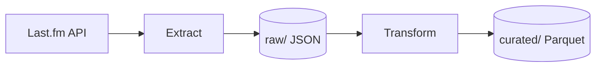

# 10 — README yazmak

> Adım 0.5 · 2026-08-10

README, projenin **kapısıdır**. Kod kalitesi ne olursa olsun, çoğu insanın gördüğü tek
dosya budur. Bu not README'nin kime yazıldığını, hangi bölümlerden oluştuğunu, nasıl test
edildiğini ve en sık yapılan hataları toplar.

> **Kısa cevap** — README kime yazılır ve neden çoğu README yalan söyler?
>
> 1. Aspirational README en büyük hata: çalışmayan komut yazmak, projenin bitmemiş olmasından daha kötü bir sinyaldir.
> 2. README kapıdır, `docs/` odalardır; aynı bilgiyi iki yerde tutmak kaçınılmaz sapma demektir, derinliğe link verilir.
> 3. Doküman elle test edilir: `$` prompt işareti kopyalamayı bozar, /tmp'de yabancı gibi baştan denemek şarttır.
>
> Bu üçü yeterliyse aşağısını okumana gerek yok.

---

## 1. Neden bu kadar önemli

GitHub, repo ana sayfasında dosya listesinin **hemen altına** README'yi render eder.
Yani ziyaretçi onu aramaz, karşısına çıkar. Bu bir konvansiyon değil, platform davranışı —
`README.md`, `README.rst`, `README.txt` gibi isimleri GitHub, GitLab ve Bitbucket otomatik
tanır.

İsmin büyük harf olması Unix geleneğinden gelir: `ls` çıktısında büyük harfler önce
sıralanır, dolayısıyla dosya listenin en üstünde görünür. `LICENSE`, `CHANGELOG`,
`CONTRIBUTING` aynı gelenekten.

Pratik sonuç: **README'yi kimse aramaz, herkes görür.** Kötü bir README'nin maliyeti,
kötü bir iç modülün maliyetinden yüksektir — çünkü iç modülü kimse açmaz.

---

## 2. Kime yazılıyor: üç okuyucu, üç farklı ihtiyaç

En sık yapılan hata: kimin için yazdığını düşünmeden yazmaya başlamak. Sonuç, kimsenin
ihtiyacını karşılamayan bir dosya olur.

| Okuyucu | İlk 10 saniyede aradığı | Ne ister |
|---|---|---|
| **Sen, iki hafta sonra** | "Hangi komutla başlıyordum" | Kopyala-yapıştır |
| **Interviewer / işveren** | "Bu kişi ne biliyor" | Kısa, taranabilir, sinyal yoğun |
| **Öğrenmek isteyen** | "Bu nasıl yapılmış" | Derinlik, gerekçe |

Üçü **çelişir**. Junior'ın istediği derinlik, interviewer'ı boğar.

### Çözüm: README kapıdır, `docs/` odalardır

README kısa kalır ve derinliğe **link verir**, içeriğini tekrarlamaz. Bu projede:

```
README.md      -> "ne, nasil kurulur, nereye bakilir"   (~80 satir)
docs/adr/      -> "neden bu karar"                       (karar basina bir dosya)
docs/notes/    -> "bu konu nasil calisiyor"              (ogrenme derinligi)
```

Bir bilgiyi hem README'de hem `docs/`'ta anlatırsan iki gerçek üretmiş olursun ve biri
kaçınılmaz olarak eskir.

### En çok unutulan okuyucu

**Kendin.** İki makinede çalışıyorsan, ya da projeye üç ay ara verdiysen, README'nin ilk
gerçek kullanıcısı sensin. "Zaten biliyorum" diye atlanan adım, tam da altı ay sonra
hatırlanmayacak adımdır.

---

## 3. Bölüm sırası: ters piramit

Gazetecilikten gelen bir prensip: **en önemli bilgi en üstte.** Okuyucu her an okumayı
bırakabilir; bıraktığı noktaya kadar en değerli şeyi almış olmalı.

Tipik sıra (bu bir konvansiyondur, resmî bir standart değil):

| Sıra | Bölüm | Zorunlu mu |
|---|---|---|
| 1 | Başlık + 1-3 cümle özet | **Evet** |
| 2 | Badge'ler (CI, coverage, sürüm) | Hayır — CI varsa |
| 3 | Status / olgunluk uyarısı | Proje bitmemişse **evet** |
| 4 | Demo / ekran görüntüsü / örnek çıktı | Görsel bir şeyse |
| 5 | Prerequisites | **Evet** |
| 6 | Installation / Setup | **Evet** |
| 7 | Usage — en az bir çalışan örnek | Çalışan kod varsa **evet** |
| 8 | Project structure | Faydalı |
| 9 | Architecture | Portfolyo projesinde **evet** |
| 10 | Documentation / links | `docs/` varsa **evet** |
| 11 | Testing | Test varsa |
| 12 | Roadmap | Devam eden projede |
| 13 | Contributing | Katkı bekliyorsan |
| 14 | License | Public repo'da **evet** |

Test şu: *"Okuyucu 3. bölümden sonra sekmeyi kapatırsa, en önemli şeyi öğrenmiş olur mu?"*

### Standart bir README şablonu var mı

Kısmi. [Standard Readme](https://github.com/RichardLitt/standard-readme) ve
[Awesome README](https://github.com/matiassingers/awesome-readme) gibi topluluk
girişimleri var ama bunlar **resmî standart değil** — yaygın konvansiyonların
derlemesidir. Zorunlu tek şey dosya adıdır.

---

## 4. İlk paragraf: en zor bölüm

Okuyucunun gördüğü ilk şey ve genelde en kötü yazılan yer.

### Kötü

```markdown
# my-project

This project was created as part of my learning journey. I have always been
passionate about data engineering and wanted to build something real.
```

Üç satır okundu, projenin **ne yaptığı** hâlâ bilinmiyor.

### İyi

```markdown
# Last.fm ETL Pipeline

A batch ETL pipeline that extracts listening data from the Last.fm API, stores it as
immutable raw JSON, transforms it into partitioned Parquet, and is designed to run on
AWS (S3, Lambda, EventBridge, Athena).
```

Tek cümlede: **ne** (batch ETL pipeline), **hangi veri** (Last.fm), **hangi akış**
(JSON → Parquet), **hangi teknolojiler** (AWS servisleri).

### Formül

> `<Ne olduğu>` that `<ne yaptığı>`, using `<hangi teknolojiler>`.

Teknoloji isimleri **kasıtlı** olarak ilk paragrafta. Interviewer README'yi okumaz,
**tarar** — gözü tanıdık kelimelere takılır. Bir işe alım süreci içinde bu kelimeler
kelimenin tam anlamıyla arama terimidir.

**Junior tuzağı:** kişisel motivasyonla başlamak ("I've always been interested in..."). Bu
bilgi değersiz değil ama ilk paragrafta değil, en sonda ya da hiç.

---

## 5. Status bölümü ve "aspirational README" tuzağı

En tehlikeli README hatası: projenin **olacağı** hâli, **olan** hâli gibi yazmak.

```markdown
## Usage

```bash
lastfm-etl --date 2026-08-10 --dry-run
```
```

Böyle bir komut yoksa bu satır **yalandır**. Kimse yalan söylemek istemez; README'yi
"bitirmek" isterken planı gerçekmiş gibi yazmak çok kolaydır.

### Neden bu kadar kötü

**Doküman test edilmez.** Kod yanlışsa CI kırmızı yanar, test patlar, biri fark eder.
README yanlışsa aylarca kimse görmez — ta ki biri klonlayıp komutu çalıştırana kadar.

Ve o "biri" genelde en kötü zamanda gelir: interviewer. Klonlar, README'deki komutu
çalıştırır, patlar. Aldığı sinyal artık "iyi proje" değil, **"yazdığını denememiş"**.

### Çözüm: dürüst bir Status bölümü

```markdown
## Status

**Work in progress — step 0 of 9 (repository setup).**

The pipeline is not runnable yet: no extract, transform or load code exists.
```

Bitmemiş bir projeyi bitmiş gibi sunmak, bitmemiş olmasından çok daha kötü bir sinyaldir.
Dürüstlük burada zayıflık değil, **kalibrasyon** göstergesidir: kendi işinin durumunu
doğru raporlayabilen mühendis, tahmin verirken de güvenilirdir.

> **Kural: README yalnızca bugün çalışan komutları içerir.**

---

## 6. Kurulum talimatı yazma kuralları

Bu bölüm README'nin en çok kullanılan ve en çok bozulan yeridir.

### Kural 1 — Prompt işareti koyma

````markdown
Kotu:
```bash
$ uv sync
$ cp .env.example .env
```

Iyi:
```bash
uv sync
cp .env.example .env
```
````

`$` işareti kopyalanır ve komut patlar. Çok satırlı blokta bu daha da can sıkıcıdır.
İstisna: girdi ile çıktıyı aynı blokta göstermen gerekiyorsa `$` ayırt edici olur — ama
o zaman blok kopyalanamaz hâle gelir, bunu bilerek yap.

### Kural 2 — Her komutun neden orada olduğunu söyle

```bash
# Create .venv/ and install exactly what uv.lock specifies
uv sync
```

`uv sync` tek başına bir **emirdir**. Yorumla birlikte bir **açıklamadır**. Okuyucu
komutun ne yaptığını bilirse, patladığında teşhis edebilir.

### Kural 3 — Doğrulama komutu ver

```bash
uv run python -c "import lastfm_etl; print('ok')"
```

Kurulumun bittiğini nereden anlayacağını söylemeyen README yarım kalmıştır. Okuyucu
"acaba oldu mu" diye devam eder ve ilk gerçek hatada başa döner.

### Kural 4 — Kod bloklarına dil etiketi yaz

````markdown
```bash
```python
```toml
```json
```
````

Sözdizimi renklendirmesi için. Etiketsiz blok düz gri metin olarak render edilir.
Klasör ağaçları ve genel çıktı için etiket verilmez (boş bırakılır).

### Kural 5 — Hangi shell'i varsaydığını söyle

`cp .env.example .env` Git Bash, macOS ve Linux'ta çalışır; Windows CMD'de çalışmaz
(`copy`). README'nin varsayımını belirtmezsen kullanıcı ilk adımda takılır.

Profesyonel repolar bunu iki yoldan çözer: ya varsayımı açıkça yazar, ya `make setup`
gibi bir katmanla shell farkını gizler. (Bu projede Adım 8.3'te `Makefile` gelecek —
asıl sebeplerinden biri bu.)

---

## 7. Neyi README'ye koymamalı

| Koyma | Nereye ait | Neden |
|---|---|---|
| Uzun mimari gerekçeleri | `docs/adr/` | README kapı, oda değil |
| Değişiklik geçmişi | `CHANGELOG.md` | Ayrı yaşam döngüsü |
| Detaylı API dokümanı | `docs/` veya docstring | README eskir, docstring kodla yaşar |
| Kişisel öğrenme notları | `docs/notes/` | Farklı okuyucu |
| Henüz çalışmayan komutlar | Hiçbir yere | Yalan |
| Yapılacaklar listesi | `ROADMAP.md` / issue'lar | README plan dosyası değil |

**Genel kural:** README'de bir bilgi **tek** cümleyle özetlenip derinliğe link
verilebiliyorsa, öyle yapılır.

### Bilinçli tekrar

Bazı tekrarlar kabul edilir. Örnek: Python sürümü hem `pyproject.toml`'da hem README'de
yazar. Sebep — okuyucuyu `pyproject.toml` açmaya zorlamak kötü bir karşılamadır.

Kural şu: **her tekrar kötü değil, maliyeti bilinçli kabul edilen tekrar olur.** Maliyet
burada, sürüm değişince iki yeri güncellemek zorunda kalmak. Bunu bilerek kabul ediyorsan
sorun yok; farkında değilsen o bir hatadır.

---

## 8. Badge'ler

README'nin üstündeki küçük renkli etiketler (shields.io). Ne işe yararlar:

| Badge | Ne söyler | Ne zaman ekle |
|---|---|---|
| CI status | Testler geçiyor mu | CI kurulduktan sonra (8.5) |
| Coverage | Test kapsamı | Coverage ölçülüyorsa (7.7) |
| Python version | Desteklenen sürümler | Yayınlanan kütüphanede |
| License | Lisans | Public repo'da |
| Code style | `ruff` / `black` kullanılıyor | Lint kurulduktan sonra (8.1) |

**Tuzak:** badge, bir şeyin **var olduğunu** iddia eder. CI yokken CI badge'i koymak —
ya kırık görünür, ya da daha kötüsü, hiç çalışmayan bir workflow'a işaret eder. Bu
"aspirational README"nin görsel hâlidir.

**Junior tuzağı:** README'yi profesyonel göstermek için sekiz badge sıralamak. Bir
interviewer için üç yeşil badge (CI, coverage, license) inandırıcıdır; sekiz badge
gürültüdür.

Bu projede badge'ler 8.5'ten sonra eklenecek — çünkü o zamana kadar iddia edecek bir
şey yok.

---

## 9. Görseller ve diyagramlar

Portfolyo projesinde **mimari diyagramı en yüksek getirili tek eklemedir**. Bir
interviewer 30 saniyede metin okumaz, şemaya bakar.

Üç yol:

**1. Mermaid** — GitHub markdown içinde doğrudan render eder, ayrı dosya gerekmez:

````markdown

````

Avantajı: metin olarak versiyonlanır, `git diff` okunabilir. Bu projenin
`ROADMAP.md`'sinde bağımlılık haritası bu şekilde yazıldı.

**2. Statik görsel** (`docs/images/architecture.png`) — repoya konur, relative path ile
gösterilir: ``. Karmaşık şemalarda mermaid
yetmezse.

**3. Terminal çıktısı / GIF** — CLI aracıysa `asciinema` veya basit bir kod bloğu.

**Relative link kuralı:** GitHub'da `docs/adr/` gibi göreli yollar çalışır ve repo
içinde gezinir. Mutlak GitHub URL'si yazma — fork'ta veya branch'te kırılır.

---

## 10. Lisans, katkı, davranış kuralları

| Dosya | Ne zaman gerekir |
|---|---|
| `LICENSE` | Public repo'da **her zaman**. Yoksa varsayılan "tüm hakları saklı" — kimse yasal olarak kullanamaz |
| `CONTRIBUTING.md` | Dışarıdan katkı bekliyorsan |
| `CODE_OF_CONDUCT.md` | Topluluk projesi büyüdüğünde |
| `SECURITY.md` | Güvenlik açığı bildirimi için bir kanal gerektiğinde |

Portfolyo projesinde ilk ikisi yeterlidir. Lisans seçimi:
[choosealicense.com](https://choosealicense.com) — MIT en izin verici ve en yaygın olanı.

**Sık yanılgı:** "Public repo = herkes kullanabilir." Hayır. Lisans dosyası yoksa
telif hakkı varsayılan olarak sende kalır ve teknik olarak kimsenin kullanma,
kopyalama veya değiştirme hakkı yoktur.

---

## 11. README nasıl test edilir

Kod test edilir, doküman edilmez — bu yüzden README elle test edilmelidir. Üç seviye:

### Seviye 1 — Render kontrolü

Markdown kaynağını okumak **yetmez**. GitHub'a push edip render edilmiş hâline bak, ya da
editörde önizleme aç (VS Code: `Ctrl+Shift+V`).

Bu projede yaşandı: klasör ağacı kod bloğu (` ``` `) içine alınmamıştı. Kaynak hâlinde
düzgün görünüyordu, render edildiğinde satırlar birleşip hizalama tamamen bozuluyordu.

### Seviye 2 — Kopyala-yapıştır testi

README'deki her komutu **sırayla**, düzenlemeden çalıştır.

### Seviye 3 — Yabancı testi (en değerlisi)

Boş bir klasörde, sıfırdan:

```bash
cd /tmp
git clone <repo-url> readme-test
cd readme-test
# README'yi bastan sona, kendi reponu hic bilmiyormus gibi takip et
```

Takıldığın her yer README'nin eksiğidir — senin bilgi eksiğin değil. Kendi makinende
kurulu olan bir şey (uv, doğru Python sürümü, ortam değişkeni) README'de yazmıyorsa,
temiz makinede fark edilir.

**Prod'da ne kırılır:** README'nin bozulması sessizdir. Yeni bir bağımlılık eklersin,
kurulum adımı değişir, README eski kalır. Bunu yakalayan tek şey periyodik yabancı
testidir. Büyük projeler bunu CI'a bağlar — README'deki kod bloklarını çıkarıp çalıştıran
araçlar vardır.

---

## 12. Proje türüne göre farklar

README'nin içeriği projenin **ne olduğuna** göre değişir:

| Tür | Ağırlık merkezi | Örnek |
|---|---|---|
| **Kütüphane** | Usage — ilk 20 satırda çalışan bir kod örneği | `requests`, `pydantic` |
| **CLI aracı** | Komut örnekleri, bayrak listesi, GIF | `ruff`, `uv` |
| **Uygulama / servis** | Kurulum, config, deployment, mimari | Bu proje |
| **Portfolyo** | Mimari + alınan kararlar + neyin neden yapıldığı | Bu proje |

Bu proje son iki kategorinin kesişiminde. Pratik sonuç: `docs/adr/` klasörü, README'nin
en değerli linkidir — çünkü portfolyo bağlamında değerlendirilen şey kodun kendisi değil,
**karar verme biçimidir**.

---

## 13. Anti-pattern listesi

| Hata | Neden kötü |
|---|---|
| Çalışmayan komut | En büyük güven kaybı |
| Kişisel motivasyonla başlamak | İlk 3 satır bilgi taşımalı |
| Her şeyi README'ye tıkmak | 800 satırlık README kimse okumaz |
| `$` prompt işareti | Kopyala-yapıştır bozulur |
| Dil etiketsiz kod bloğu | Renklendirme yok, okunması zor |
| Render edilmiş hâline bakmamak | Bozuk tablo, bozuk ağaç |
| Sekiz badge | Gürültü; üç yeşil badge daha inandırıcı |
| "TODO: write docs" | Bitmemiş dokümanı ilan etmek, boş bırakmaktan kötü |
| Mutlak GitHub linkleri | Fork/branch'te kırılır |
| Lisanssız public repo | Kimse yasal olarak kullanamaz |
| Ekran görüntüsü yerine uzun anlatım | Görsel proje anlatılmaz, gösterilir |
| README'yi son güne bırakmak | Kurulum adımları o zamana kadar unutulur |

---

## 14. Kontrol listesi

Commit'ten önce:

- [ ] İlk paragraf projenin ne yaptığını ve teknolojileri söylüyor
- [ ] Proje bitmemişse Status bölümü var ve dürüst
- [ ] Her komut **bugün** çalışıyor — elle denendi
- [ ] Kod bloklarında `$` yok, dil etiketi var
- [ ] Kurulum sonunda bir doğrulama komutu var
- [ ] Klasör ağacı ve tablolar kod bloğu/tablo sözdizimi içinde
- [ ] Render edilmiş hâli kontrol edildi
- [ ] Linkler çalışıyor ve göreli (relative)
- [ ] `<username>` gibi placeholder kalmadı
- [ ] Derinlik gerektiren her konu `docs/`'a link veriyor, tekrarlanmıyor
- [ ] Public repo'ysa `LICENSE` var

---

## 15. Mülakat

**"README'de ne olmalı?"**
→ *"Kime yazdığına bağlı. Uygulamada kurulum ve mimari, kütüphanede ilk 20 satırda
çalışan bir kullanım örneği. Ortak kural: README kapıdır, derinlik `docs/`'ta yaşar ve
README oraya link verir — aynı bilgiyi iki yerde tutmak sapma demektir."*

**"README'yi ne zaman yazarsın?"**
→ *"Kurulum adımları netleştiği anda, projenin sonunda değil. Sonuna bırakılırsa
kurulumun nasıl yapıldığı unutulur ve README temiz makinede test edilmemiş olur.
Bir yaklaşım olarak README-driven development bunu uca taşır: README'yi kod yazılmadan
önce yazmak, arayüzü kullanıcı gözünden tasarlamaya zorlar. Herkesin benimsediği bir
pratik değil ama fikri sağlam."*

**"Bitmemiş bir projede README'ye ne yazarsın?"**
→ *"Bitmemiş olduğunu. Status bölümüyle nerede olduğunu açıkça yazarım. Çalışmayan bir
komutu README'ye koymak, projenin bitmemiş olmasından daha kötü bir sinyaldir — çünkü
denenmediğini gösterir."*

---

## Sözlük

| Terim | Anlamı |
|---|---|
| **badge** | README üstündeki durum etiketi (CI, coverage). Genelde shields.io üzerinden |
| **GFM** | GitHub Flavored Markdown — GitHub'ın markdown lehçesi (tablo, görev listesi, mermaid) |
| **mermaid** | Metin ile diyagram yazma sözdizimi. GitHub markdown içinde render eder |
| **relative link** | Repo içi göreli yol (`docs/adr/`). Fork ve branch'lerde çalışmaya devam eder |
| **README-driven development** | Kodu yazmadan önce README yazma yaklaşımı (Tom Preston-Werner, 2010). Bir görüş, standart değil |
| **ters piramit** | Gazetecilik prensibi: en önemli bilgi en üstte |
